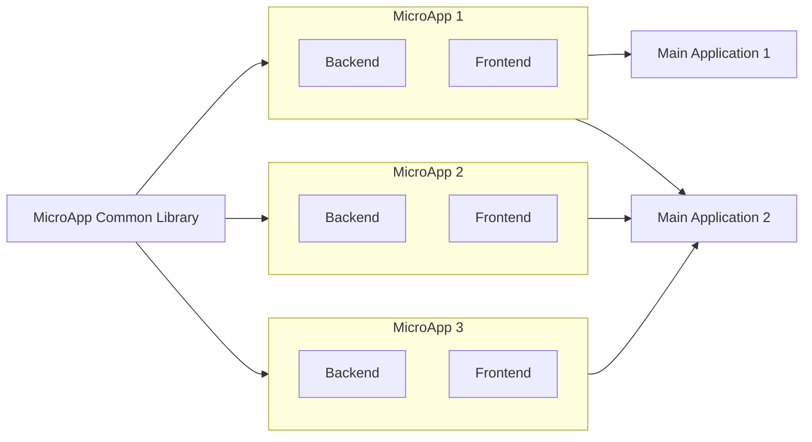

# Building a MicroApp

A microapp is a small application with its own **independent repository, backend, frontend, and deployments**. It is specifically designed and developed to create single, small UIs in the form of widgets, plugins, or components. These MicroApps have their frontend, backend, and deployment within a single repository and can be integrated into larger applications.

Micro frontends are a web development pattern that breaks down a single application into smaller, independent modules called micro frontends. Each micro frontend is responsible for a specific feature or functionality and can be developed, tested, and deployed independently.

## ⛯ UseCase
Imagine having a requirement to create a location selector with dropdown selectors for country, state, and city, along with the main street address. This type of requirement is common among multiple apps that ask for location and address submission. This requirement involves creating a UI and writing backend code to connect with location services that provide country, city, and state data. Writing this for multiple apps is time-consuming, leading to code duplication, maintainability issues across multiple applications, and the need to write test cases. Any future requirements or upgrades need to be synced across all applications.

Building the same thing as microapps offers the advantage of keeping all the code in one place, ensuring reusability and easy maintainability. New requirements can be implemented and deployed without rebuilding or restarting the main application. microapps can be used as components in multiple applications.

## ★ Advantages
- **Modularity:** Each microapp is a self-contained module, making it easier to develop, test, and maintain. This modularity allows developers to focus on specific functionalities without affecting the entire system.
- **Independent Deployments:** Microapps can be deployed independently of each other. This means updates or changes to one microapp do not require redeploying the entire application, reducing downtime and deployment risks.
- **Reusability:** Microapps can be reused across multiple applications. Once a microapp is developed, it can be integrated into different projects, saving development time and effort.
- **Easy Maintainability:** With microapps, maintaining and updating code becomes simpler. Since each microapp is a separate entity, changes can be made without impacting other parts of the system, leading to easier bug fixes and feature enhancements.

## ⚠ Disadvantages
- **Increased Complexity:** Managing multiple microapps can be complex, especially when they need to communicate with each other.
- **Deployment Overhead:** Each microapp requires its own deployment pipeline, which can increase the overhead.
- **Resource Consumption:** Running multiple microapps can consume more resources compared to a monolithic application.
- **Network Latency:** Communication between microapps over the network can introduce latency.
- **Duplication:** Creating microapps could lead to duplication if there is common logic, function, or component that needs to be used in multiple microapps. (Could be solved with Common Library)

## ♺ Integrating a Common Library to MicroApps
When creating microapps, you might encounter duplication of common logic, functions, or components across multiple apps. For instance, authentication is often needed in all microapps. Writing authentication code for each one can lead to redundant code. To avoid this, you can integrate a common library that contains all shared backend functions and UI components, which can be used across multiple microapps.

## ☐ Architecture

## ｛｝Development Strategies
Creating multiple microapps across different applications often involves copying an existing microapp repository to a new one. To streamline this process, you can create a common microapp boilerplate template repository. This template can be used to generate new microapps whenever needed.

Here’s how it works:
- **Boilerplate Template:** Develop a boilerplate repository that acts as a framework for all microapps. This template will include configurations for the backend, frontend, testing libraries, development scripts, and CI/CD pipeline scripts.
- **Creating New Microapps:** Whenever you need to create a new microapp, use this boilerplate template. This ensures consistency and saves time.
- **Updating Microapps:** If there are any changes in the boilerplate repository, you can rebase these changes across all microapp repositories. This can be done by adding the boilerplate repository as a second remote URL in each microapp repository.
- **Consistency:** This approach ensures a common methodology and structure across all microapps, making maintenance and updates more manageable.

By using a common boilerplate template, you can simplify the creation and management of multiple microapps, ensuring they all follow the same standards and configurations.

Additionally, the same method can be used for creating a common library repository for microapps.

## ⊿ Project Setup
A Microapp boilerplate repository should include both the frontend (view) and backend (service) code, with the choice of technologies depending on the developer’s preference and the project’s requirements. Common backend choices include Spring Boot, Django, and Node.js, while for the frontend, frameworks like Angular and Vue.js, as well as libraries like React, are popular options.

#### Integration of Microfrontend
The frontend part of the Microapp will be used as a microfrontend that can be integrated into other applications. There are several methods to achieve this integration:

- Module Federation: Allows sharing code and dependencies between different applications at runtime.
- Single SPA (Single Single Page Application): Enables multiple frameworks to coexist in a single application.
- Iframe Integration: Embeds one application within another using iframes.

#### Repository Setup
The Microapp repository should be well-structured, with separate folders for backend and frontend code to enhance clarity and organization. Establishing generic rules for folder and file naming conventions is essential. Additionally, the repository should include all necessary commands to set up the development environment, create production build packages, and run test cases. This approach ensures a streamlined and consistent setup process.

- Testing Library: The repository should include a testing library for writing test cases to ensure code quality and functionality.
- CI/CD Pipeline: Settings for Continuous Integration and Continuous Deployment (CI/CD) should be configured to automate the build, test, and deployment processes. 

#### Common Library Integration
A common library can be integrated into the Microapp repository to house shared code for both service and UI components. This promotes code reuse and maintainability.

#### Goals
The primary goals of this setup are:
- Modularity: Ensuring that each component is self-contained and can be developed, tested, and deployed independently.
- Maintainability: Keeping the codebase organized and easy to manage over time.

## 📦 Example Repositories
Here are example boilerplate repositories that I have set up. The microapp-boilerplate is a template to create microapps with all frontend and backend configurations, test case setups, and necessary commands to set up the development environment and create production builds.

The second repository consists of a common shared library that can be used in multiple microapps to store common functions or UI components.

The goal of microapps is to create small, mini, micro, or nano applications that can be seamlessly integrated into larger applications, thereby increasing modularity and maintainability.

Thank you for reading this blog. _Sayonara!_