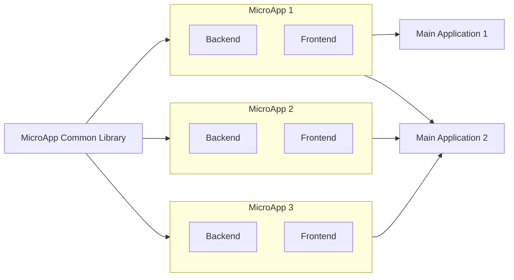

# Building a MicroApp

A microapp is a small application with its own **independent repository, backend, frontend, and deployments**. It is specifically designed and developed to create single, small UIs in the form of widgets, plugins, or components. These MicroApps have their frontend, backend, and deployment within a single repository and can be integrated into larger applications.

## ⛯ UseCase
Imagine having a requirement to create a location selector with dropdown selectors for country, state, and city, along with the main street address. This type of requirement is common among multiple apps that ask for location and address submission. This requirement involves creating a UI and writing backend code to connect with location services that provide country, city, and state data. Writing this for multiple apps is time-consuming, leading to code duplication, maintainability issues across multiple applications, and the need to write test cases. Any future requirements or upgrades need to be synced across all applications.

Building the same thing as microapps offers the advantage of keeping all the code in one place, ensuring reusability and easy maintainability. New requirements can be implemented and deployed without rebuilding or restarting the main application. microapps can be used as components in multiple applications.

## ★ Advantages
- **Modularity:** Each microapp is a self-contained module, making it easier to develop, test, and maintain. This modularity allows developers to focus on specific functionalities without affecting the entire system.
- **Independent Deployments:** Microapps can be deployed independently of each other. This means updates or changes to one microapp do not require redeploying the entire application, reducing downtime and deployment risks.
- **Reusability:** Microapps can be reused across multiple applications. Once a microapp is developed, it can be integrated into different projects, saving development time and effort.
- **Easy Maintainability:** With microapps, maintaining and updating code becomes simpler. Since each microapp is a separate entity, changes can be made without impacting other parts of the system, leading to easier bug fixes and feature enhancements.

## ⚠ Disadvantages
- **Increased Complexity:** Managing multiple microapps can be complex, especially when they need to communicate with each other.
- **Deployment Overhead:** Each microapp requires its own deployment pipeline, which can increase the overhead.
- **Resource Consumption:** Running multiple microapps can consume more resources compared to a monolithic application.
- **Network Latency:** Communication between microapps over the network can introduce latency.
- **Duplication:** Creating microapps could lead to duplication if there is common logic, function, or component that needs to be used in multiple microapps. (Could be solved with Common Library)

## Integrating a Common Library to MicroApps
When creating microapps, you might encounter duplication of common logic, functions, or components across multiple apps. For instance, authentication is often needed in all microapps. Writing authentication code for each one can lead to redundant code. To avoid this, you can integrate a common library that contains all shared backend functions and UI components, which can be used across multiple microapps.

## Architecture
